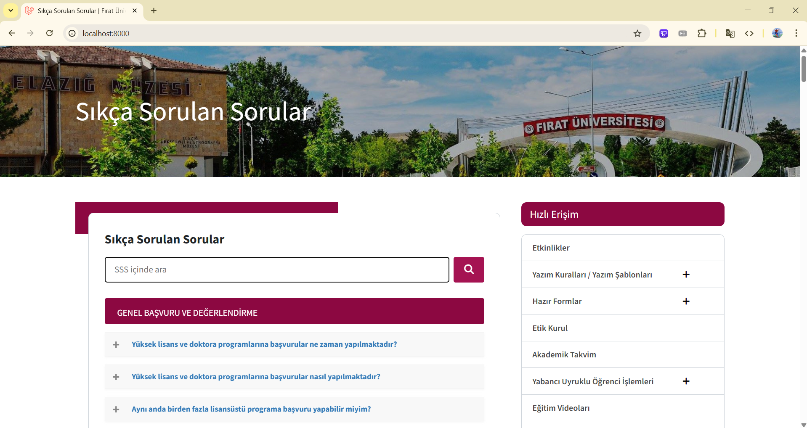
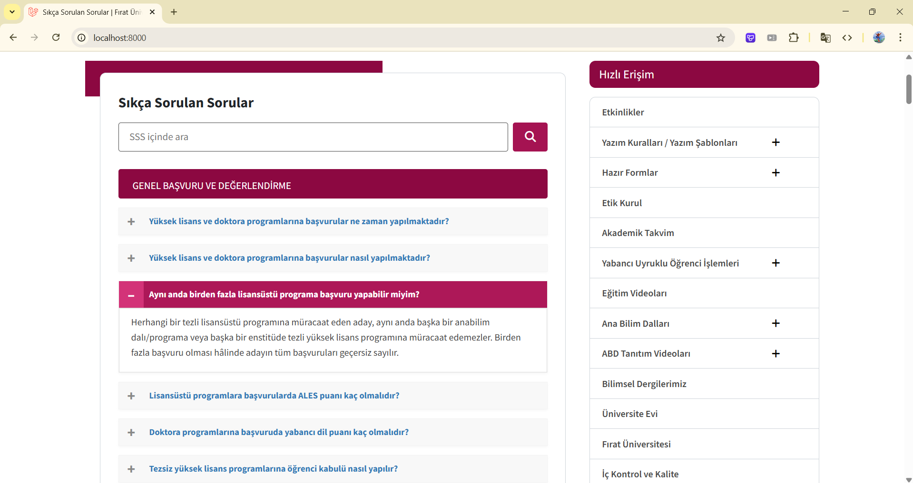
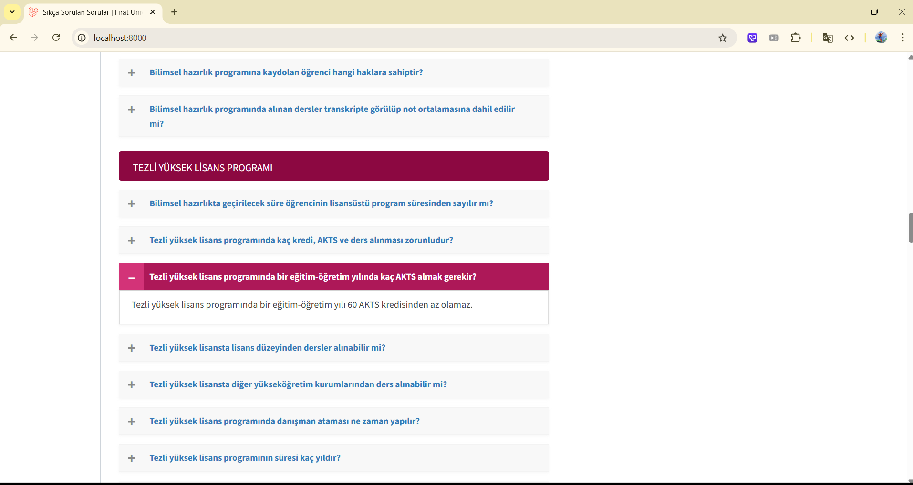
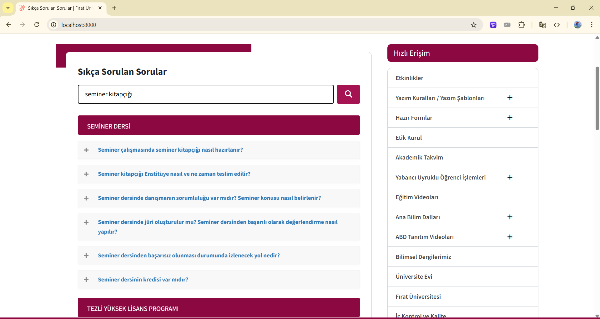
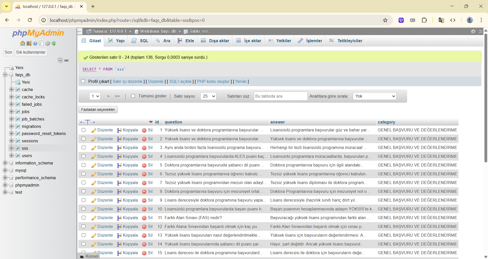

# Fırat Üniversitesi SSS (Sıkça Sorulan Sorular) Projesi

Bu proje, Fırat Üniversitesi öğrencileri ve ziyaretçileri için sıkça sorulan soruları yanıtlayan, modern ve kullanıcı dostu bir web uygulamasıdır.

## 🚀 Özellikler

-   📱 Responsive tasarım
-   🔍 Gelişmiş arama ve filtreleme özellikleri
-   📑 Kategori bazlı soru organizasyonu
-   💾 MySQL veritabanı entegrasyonu
-   🎯 MVC (Model-View-Controller) mimarisi
-   ⚡ Dinamik içerik yönetimi

## 🔍 Kullanım

1. Ana sayfada tüm soruları görüntüleyebilirsiniz
2. Kategorilere göre soruları filtreleyebilirsiniz
3. Arama kutusunu kullanarak soruları arayabilirsiniz
4. Bir soruya tıkladığınızda detaylı cevabını görebilirsiniz

## 🛠️ Teknolojiler

-   Laravel Framework
-   PHP 10.x
-   MySQL
-   HTML5
-   CSS3
-   JavaScript
-   Bootstrap

## 📸 Ekran Görüntüleri

### Ana Sayfa



### Soru Detayı



### Kategoriler



### Soru Filtreleme



### Veritabanı Yapısı



## 📋 Kurulum

1. Projeyi klonlayın:

```bash
git clone https://github.com/AliKacarr/Firat-University-FAQ.git
cd Firat-University-FAQ
```

2. Composer bağımlılıklarını yükleyin:

```bash
composer install
```

3. `.env` dosyasını oluşturun:

```bash
cp .env.example .env
```

4. Veritabanı ayarlarını yapılandırın:

-   `.env` dosyasında veritabanı bilgilerinizi güncelleyin
-   MySQL'de yeni bir veritabanı oluşturun
-   Migration'ları çalıştırın:

```bash
php artisan migrate
```

5. Veritabanı verilerini içe aktarın:

-   `sss.sql` dosyasını phpMyAdmin üzerinden içe aktarın
-   VEYA kendi SSS tablolarınızı oluşturun

6. Uygulama anahtarını oluşturun:

```bash
php artisan key:generate
```

7. Uygulamayı başlatın:

```bash
php artisan serve
```

## 🤝 Katkıda Bulunma

1. Bu depoyu fork edin
2. Yeni bir branch oluşturun (`git checkout -b feature/yeniOzellik`)
3. Değişikliklerinizi commit edin (`git commit -am 'Yeni özellik: Açıklama'`)
4. Branch'inizi push edin (`git push origin feature/yeniOzellik`)
5. Pull Request oluşturun

## 📝 Lisans

Bu proje MIT lisansı altında lisanslanmıştır. Daha fazla bilgi için `LICENSE` dosyasına bakın.

## 📞 İletişim

Proje Sahibi - [@AliKacarr](https://github.com/AliKacarr)

Proje Linki: [https://github.com/AliKacarr/Firat-University-FAQ](https://github.com/AliKacarr/Firat-University-FAQ)
